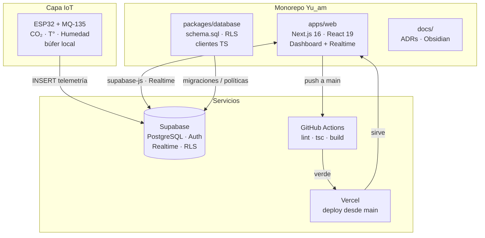

[English](./README.md) | Español

# YU'AM v2.0 — Telemetría y control en tiempo real para fotobiorreactores

[](https://github.com/Alexzz-19/Yu_am/actions/workflows/ci.yml)
[](https://nextjs.org/)
[](https://supabase.com/)
[](https://www.typescriptlang.org/)
[](https://opensource.org/licenses/MIT)

> Sistema de telemetría y control en tiempo real para fotobiorreactores. Arquitectura basada en monorepo con ingesta de datos IoT y dashboard web en Next.js.

## Arquitectura



## Estructura del monorepo

```text
Yu_am/
├── .ai/                     # Configuración de IA (AGENTS.md, CLAUDE.md, CONTEXT.md)
├── .github/workflows/ci.yml # CI: lint + tsc + build en apps/web
├── apps/web/                # Frontend Next.js (App Router, TS estricto, Tailwind)
├── packages/database/       # Esquema PostgreSQL, RLS y clientes Supabase (TS)
└── docs/                    # ADRs, guías de deploy y Vault de Obsidian
```

## Requisitos previos

- Node.js 20.x y npm
- Git
- Proyecto Supabase (URL + anon key)

## Instalación y ejecución local

```bash
# 1. Clonar
git clone https://github.com/Alexzz-19/Yu_am.git
cd Yu_am

# 2. Dependencias del frontend y del backend (scripts Supabase)
npm install --prefix apps/web
npm install --prefix packages/database

# 3. Variables de entorno del frontend
cp apps/web/.env.example apps/web/.env.local
# Editar apps/web/.env.local con URL y anon key reales de Supabase

# 4. Servidor de desarrollo
npm run dev --prefix apps/web
# http://localhost:3000
```

## Verificación (puerta de entrada a `main`)

```bash
cd apps/web
npm run lint        # ESLint, 0 errores / 0 advertencias
npx tsc --noEmit    # TypeScript estricto, sin `any`
npm run build       # Compilación de producción
```

Todo PR a `main` debe traer este checklist en verde (ver `.github/PULL_REQUEST_TEMPLATE.md`).

## Variables de entorno

| Variable | Alcance | Fuente |
|---|---|---|
| `NEXT_PUBLIC_SUPABASE_URL` | `apps/web/.env.local` | Supabase > Project Settings > API |
| `NEXT_PUBLIC_SUPABASE_ANON_KEY` | `apps/web/.env.local` | Supabase > Project Settings > API (anon) |
| `FIGMA_ACCESS_TOKEN` | `apps/web/.env.local` (solo local) | Figma > Account Settings > Personal tokens |
| `SUPABASE_SERVICE_ROLE_KEY` | `packages/database/.env` (nunca en cliente) | Supabase > Project Settings > API (service_role) |

Ningún `.env` se versiona; solo plantillas `*.example`.

## Decisiones de arquitectura (ADRs)

- [`docs/adr/0001-stack-base-y-mcp.md`](docs/adr/0001-stack-base-y-mcp.md) — Next.js + Supabase + protocolo MCP.

## Contexto del proyecto

- **Dominio:** biotecnología e IoT ambiental (MILAB / YU'AM, "Vida, Alma y Salud" en Q'eqchi').
- **Alineación:** Plan Nacional de Desarrollo K'atun 2032 (Guatemala), ODS 3, 4, 11, 12 y 13.
- **Privacidad:** Privacy-by-Design — coordenadas de nodos ofuscadas en vistas públicas.
- **Gobernanza de IA:** ver `.ai/AGENTS.md` (cerebro global) y `.ai/CONTEXT.md` (estado operativo).

## Origen y contexto

YU'AM nace en Guatemala (MILAB) con raíces locales: su nombre en Q'eqchi' —"Vida, Alma y Salud"— y su alineación con el Plan Nacional de Desarrollo K'atun 2032 orientan cada decisión del proyecto. Esa base local se diseña para escalar globalmente: telemetría IoT agnóstica al despliegue, Supabase multirregión, dashboard Next.js internacionalizado (EN/ES) y gobernanza abierta lista para contribuidores de cualquier país.

## Soporte

- **Soporte técnico:** `bionexo_support@proton.me`
- **Revisión de aportes:** Biblioteca YU'AM / MILAB
