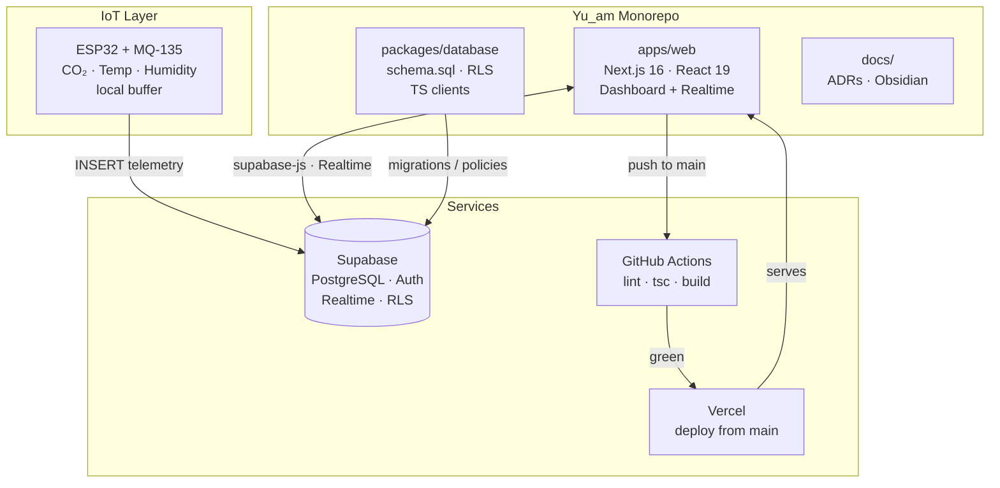

English | [Español](./README.es.md)

# YU'AM v2.0 — Real-time telemetry and control for photobioreactors

[](https://github.com/Alexzz-19/Yu_am/actions/workflows/ci.yml)
[](https://nextjs.org/)
[](https://supabase.com/)
[](https://www.typescriptlang.org/)
[](https://opensource.org/licenses/MIT)

> Real-time telemetry and control system for photobioreactors. Monorepo-based architecture with IoT data ingestion and a Next.js web dashboard.

## Architecture



## Monorepo structure

```text
Yu_am/
├── .ai/                     # AI configuration (AGENTS.md, CLAUDE.md, CONTEXT.md)
├── .github/workflows/ci.yml # CI: lint + tsc + build in apps/web
├── apps/web/                # Next.js frontend (App Router, strict TS, Tailwind)
├── packages/database/       # PostgreSQL schema, RLS and Supabase clients (TS)
└── docs/                    # ADRs, deploy guides and Obsidian Vault
```

## Prerequisites

- Node.js 20.x and npm
- Git
- A Supabase project (URL + anon key)

## Local install and run

```bash
# 1. Clone
git clone https://github.com/Alexzz-19/Yu_am.git
cd Yu_am

# 2. Frontend and backend dependencies (Supabase scripts)
npm install --prefix apps/web
npm install --prefix packages/database

# 3. Frontend environment variables
cp apps/web/.env.example apps/web/.env.local
# Edit apps/web/.env.local with your real Supabase URL and anon key

# 4. Dev server
npm run dev --prefix apps/web
# http://localhost:3000
```

## Verification (gateway to `main`)

```bash
cd apps/web
npm run lint        # ESLint, 0 errors / 0 warnings
npx tsc --noEmit    # Strict TypeScript, no `any`
npm run build       # Production build
```

Every PR to `main` must bring this checklist green (see `.github/PULL_REQUEST_TEMPLATE.md`).

## Environment variables

| Variable | Scope | Source |
|---|---|---|
| `NEXT_PUBLIC_SUPABASE_URL` | `apps/web/.env.local` | Supabase > Project Settings > API |
| `NEXT_PUBLIC_SUPABASE_ANON_KEY` | `apps/web/.env.local` | Supabase > Project Settings > API (anon) |
| `FIGMA_ACCESS_TOKEN` | `apps/web/.env.local` (local only) | Figma > Account Settings > Personal tokens |
| `SUPABASE_SERVICE_ROLE_KEY` | `packages/database/.env` (never client-side) | Supabase > Project Settings > API (service_role) |

No `.env` file is versioned; only `*.example` templates.

## Architecture decisions (ADRs)

- [`docs/adr/0001-stack-base-y-mcp.md`](docs/adr/0001-stack-base-y-mcp.md) — Next.js + Supabase + MCP protocol.

## Project context

- **Domain:** biotechnology and environmental IoT (MILAB / YU'AM, "Life, Soul and Health" in Q'eqchi').
- **Alignment:** Guatemala's K'atun 2032 National Development Plan, SDGs 3, 4, 11, 12 and 13.
- **Privacy:** Privacy-by-Design — node coordinates obfuscated in public views.
- **AI governance:** see `.ai/AGENTS.md` (global brain) and `.ai/CONTEXT.md` (operating status).

## Support

- **Technical support:** `bionexo_support@proton.me`
- **Contribution review:** YU'AM Library / MILAB
